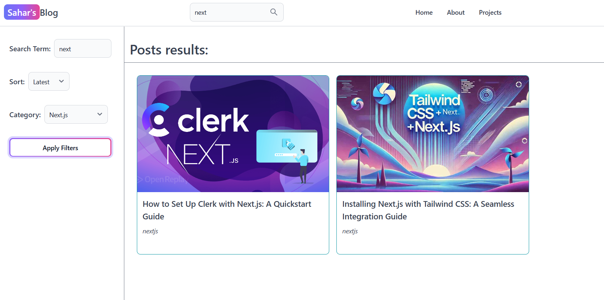

# 📝 Next.js Blog Platform

A powerful, full-featured blog application built with **Next.js** and designed for modern content creators. Featuring a rich-text editor, image uploading, user dashboard, dark mode, and authentication.

🔗 **Live Demo**: [sahar-blog.vercel.app](https://sahar-blog.vercel.app/)

---

## 📌 Overview

This application leverages **Next.js**, a robust React framework, to build server-side rendered and statically generated web applications.

I have integrated **Clerk** for seamless user authentication, providing a secure and user-friendly login experience.

The backend is powered by **MongoDB**, and I used **Mongoose** for elegant MongoDB object modeling. Images are stored and served via **Supabase Storage**.

The project supports both **regular users** and **admin users** — each with different dashboard functionalities.

---

## 🖼️ Screenshots

| Home Page                              | Search                                     | User Dashboard                                        | Admin Panel                              |
| -------------------------------------- | ------------------------------------------ | ----------------------------------------------------- | ---------------------------------------- |
|  |  |  |  |

---

## 🚀 Features

- 🧑‍💻 **User Authentication** with Clerk (email/password or Google)
- 📝 **Rich Text Editor** with image upload support
- 🌙 **Dark Mode** toggle
- 🗃️ **Supabase Storage** for media assets
- 🔐 **Role-based Access** (Admin vs Regular User)
- 🧠 **MongoDB & Mongoose** for data handling
- 🧩 **Responsive UI** for all screen sizes
- 📊 **Admin Dashboard** with content management


---

## 🔐 Admin Panel Access

You can log in as an **admin** to test full access features:

- **Username**: `"test.admi.hasti@gmail.com"`
- **Password**: `DemoAdmin123!`

> This login info is available on the sign-in page too.

Alternatively, sign in with your own email or Google account to test as a **regular user**.

---

## ▶️ How to Use

### ✍️ Creating & Managing Posts


- **Admin Users** can:
  - View, edit, and delete **all** users' posts
  - Create **new** posts
  - Access an additional **Admin Panel**

### 🌘 Toggle Dark Mode

- Use the theme toggle in the navbar to switch between dark and light modes.

---

## 🛠️ Tech Stack

### Frontend

- [Next.js](https://nextjs.org/)
- [React](https://react.dev/)
- [Tailwind CSS](https://tailwindcss.com/)
- [Flowbite React](https://flowbite.com/docs/components/)
- [React Quill New](https://www.npmjs.com/package/react-quill-new)
- [React Circular Progressbar](https://www.npmjs.com/package/react-circular-progressbar)

### Backend & Auth

- [MongoDB](https://www.mongodb.com/)
- [Mongoose](https://mongoosejs.com/)
- [Clerk](https://clerk.dev/)
- [Supabase](https://supabase.com/) (for image storage)

---

## 📦 Installation

1. **Clone the repository**:
   ```bash
   git clone https://github.com/auroraEros/next-blog.git
   cd next-blog
   ```


2. **Install dependencies**:

   ```bash
   npm install
   ```

3. **Create a `.env.local` file** and add your secrets:

   ```env
   NEXT_PUBLIC_CLERK_FRONTEND_API=your_clerk_frontend_api
   CLERK_API_KEY=your_clerk_api_key
   MONGODB_URI=your_mongodb_connection_string
   SUPABASE_URL=your_supabase_url
   SUPABASE_ANON_KEY=your_supabase_anon_key
   ```

4. **Run the app locally**:

   ```bash
   npm run dev
   ```

5. Open [http://localhost:3000](http://localhost:3000) in your browser.


---

## ✅ Roadmap / TODO

* [ ] Add likes/comments system
* [ ] Improve admin analytics dashboard
* [ ] Add post categories and filters
* [ ] Improve SEO (Open Graph, Metadata)
* [ ] Add post pagination or infinite scroll

---

## 📄 License

This project is licensed under the [MIT License](LICENSE).

---

## 📚 Learn More

* [Next.js Documentation](https://nextjs.org/docs)
* [Clerk Documentation](https://clerk.dev/docs)
* [MongoDB Docs](https://www.mongodb.com/docs/)
* [Supabase Docs](https://supabase.com/docs)
* [Tailwind CSS Docs](https://tailwindcss.com/docs)

---

Made with ❤️ by [Sahar](https://github.com/auroraEros)


